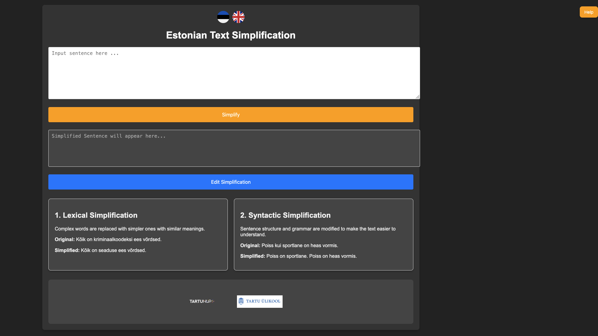

# Estonian Text Simplification with Llama 3.1

This project provides a Dockerized application for Estonian text simplification using fine-tuned Llama 3.1. It includes a web interface and a RabbitMQ-based worker architecture for efficient processing. The application leverages **unsloth** for fast processing.

**Note**: Because RabbitMQ and the Llama worker require GPU access, you must have an NVIDIA GPU with the proper environment setup to run this application.

---

## Preparing a GPU Machine for Unsloth Support

Follow these steps to install and configure the necessary environment for running the application with **Unsloth** and **Llama 3.1**:

### 1. Install Miniconda

1. **Download the Miniconda Installer**:
   - Visit the [Miniconda download page](https://docs.conda.io/en/latest/miniconda.html) and download the installer for your operating system.

2. **Install Miniconda**:
   - Run the installer and follow the instructions to install Miniconda in your desired directory, e.g., `/raid/eduard`.

---

### 2. Initialize Conda in Your Shell Configuration

1. **Add Miniconda to Your Shell Path**:
   - Open your `.bash_profile`, `.zshrc`, or the appropriate shell configuration file, and add the following line:
     ```bash
     export PATH="/raid/eduard/miniconda3/bin:$PATH"
     ```

2. **Apply the Changes**:
   - After updating the shell configuration file, apply the changes:
     ```bash
     source ~/.bash_profile  # or source ~/.zshrc
     ```

---

### 3. Set Up the Environment for Unsloth

#### 3.1 Create a New Conda Environment
Run the following command to create a new Conda environment named `unsloth_env_test`:
```bash
conda create --name unsloth_env_test \
    python=3.10 \
    pytorch=2.4.0 \
    pytorch-cuda=11.8 \
    cudatoolkit=11.8 \
    xformers=0.0.27.post2+cu118 \
    -c pytorch -c nvidia -c xformers -y
```

#### 3.2 Activate the New Environment
Activate the environment:
```bash
conda activate unsloth_env_test
```

#### 3.3 Install Required Python Packages
Install necessary dependencies using pip:
```bash
pip install numpy==1.23.5
pip install --no-deps "trl<0.9.0" peft accelerate bitsandbytes
```

#### 3.4 Install Unsloth
Install the Unsloth package directly from its GitHub repository:
```bash
pip install "unsloth[colab-new] @ git+https://github.com/unslothai/unsloth.git"
```

#### 3.5 Verify the Installation
Check if PyTorch and CUDA are installed correctly:
```bash
python -c "import torch; print(torch.__version__)"
python -c "import torch; print(torch.version.cuda)"
```

Ensure that `xformers` is properly installed:
```bash
python -m xformers.info
```

---

## Features
- **Text Simplification**: Simplifies Estonian text using a pre-trained Llama 3.1 model.
- **Web Interface**: User-friendly interface for entering and simplifying text.
- **Editing**: Allows editing and saving the automatic simplified sentence.
- **Language**: Interface available in both English and Estonian.
- **RabbitMQ Integration**: Decouples the worker process from the web server for scalable processing.

---

## Prerequisites

1. **Docker**: Ensure Docker and Docker Compose are installed.
   - [Install Docker](https://docs.docker.com/get-docker/)
   - [Install Docker Compose](https://docs.docker.com/compose/install/)

2. **Model File**: Download the Llama model from [Hugging Face](https://huggingface.co/datasets/vulturuldemare/Estonian-Text-Simplification).
   - The trained model is `llama31-model.zip`.
   - Place the model under `llama/models/`.
   - Edit the configuration file `llama/config.yaml` to point to the model.

---

## Installation

1. Clone the repository:
   ```bash
   git clone https://github.com/SoimulPatriei/webapp-llama
   cd webapp-llama
   ```

2. Build and run the application:
   ```bash
   docker-compose up --build
   ```

3. Start the Llama simplifier agent:
   ```bash
   cd llama
   python llama_simplifier.py
   ```

4. Access the server in your browser on port 5000:
   - Open the server in your browser at `http://localhost:5000`.

   

---

## Standalone Scripts

1. **`standalone_scripts/`**: This directory contains scripts for fine-tuning and simplifying Estonian sentences without using the web interface.
   - **`train_llama_model.ipynb`**: A Jupyter notebook for fine-tuning Llama 3.1 on `simplification_training_set.json`, available on [Hugging Face](https://huggingface.co/datasets/vulturuldemare/Estonian-Text-Simplification).
   - **`simplify_estonian_sentences_with_saved_model.ipynb`**: A Jupyter notebook for simplifying new Estonian sentences using a trained model.

The Colab notebooks have been tested on **Google Colab with an L4 GPU**. Input files should be placed in your **Google Drive**, and the file paths should be updated accordingly in the scripts.

---

## Credits

- **Application Programming**: Eduard Barbu  
- This software was created as part of the EKTB55 project "Teksti lihtsustamine eesti keeles".

---

## Paper

If you use this interface or want to learn more, please consult the paper:  
**Improving Estonian Text Simplification through Pretrained Language Models and Custom Datasets**  
by Eduard Barbu, Meeri-Ly Muru, Sten Marcus Malva  
[Read on arXiv](https://arxiv.org/abs/2501.15624)

## Related Project

Looking for an alternative approach to Estonian text simplification? Check out [webapp-opennmt](https://github.com/SoimulPatriei/webapp-opennmt), which simplifies Estonian text using an OpenNMT-based model. 


